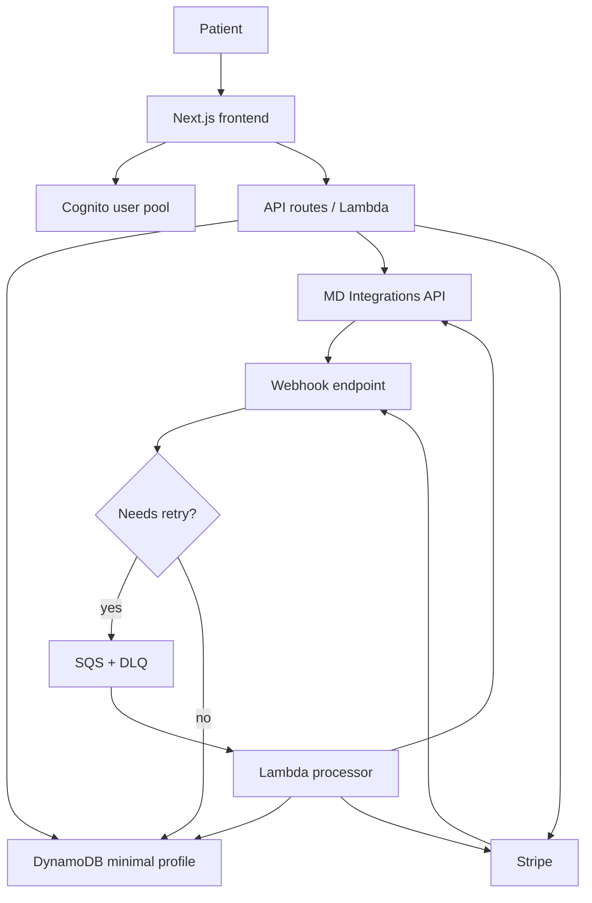

# Architecture Reset Audit

## Decision Snapshot

Apoth is moving back to a thin-platform launch architecture:

- Apoth owns patient accounts.
- Cognito is the auth provider.
- MDI is the clinical system of record.
- Apoth does not persist questionnaire answers after submission.
- Persona/KYC is out of launch scope.
- Launch target is tens of patients, with a path to hundreds/thousands.
- Infrastructure target is under $100/month at launch scale.

## Keep From Main

These are still aligned with the product:

| Area | Keep | Notes |
| --- | --- | --- |
| Marketing app | `src/app/page.tsx`, shared components, `src/lib/data.ts` | Existing public surface remains valuable. |
| Legal/compliance pages | `/about`, `/privacy`, `/terms`, `LegalReviewBanner` | Need content review, but the pages and disclosure structure stay. |
| Get-started route | `src/app/get-started/page.tsx` | Replace stub with real Cognito-gated intake flow. |
| Design system | `DESIGN.md`, `tailwind.config.ts`, `src/app/globals.css` | Keep visual foundation. |
| MDI docs | `docs/external/MD Integrations API.postman_collection.json` | Key source for intake/dashboard API work. |
| Product rules | `RULES.md` | Keep PHI/secrets constraints; update payment/auth rules as architecture changes. |
| Roadmap tracking | `.story/` | Keep, but rewrite affected tickets around Cognito/DynamoDB/serverless. |

## Bring Over Selectively From Infra Branch

The `infra` branch contains useful implementation ideas, but most should not be merged as-is.

| Area | Bring? | Notes |
| --- | --- | --- |
| Webhook signature verification | Yes, adapt | Stripe and MDI verification logic is useful, but route handlers should target Lambda/API Gateway or Next server routes without RDS/S3-first ingestion. |
| Payment invariant tests | Yes | Preserve the rule that no charge/subscription activation happens before MDI clinical completion/approval. |
| Eligibility/state tests | Yes | Useful product guardrails. |
| PHI-safe logging ideas | Yes, simplify | Keep redaction/sentinel thinking, remove heavy OTEL/Datadog assumptions. |
| Consent versioning concepts | Maybe | Keep if launch requires explicit consent audit. Store minimal consent version/timestamp in DynamoDB. |
| MDI/Stripe webhook fixtures | Yes | Useful test fixtures. Drop Persona fixtures. |
| Audit log hash chain | No for launch | Too heavy unless counsel or certification requires it. |
| KMS envelope encryption module | Probably no | DynamoDB/S3 managed encryption is enough for launch unless we store sensitive custom fields. |

## Drop Or Rewrite

These conflict with the new launch architecture:

| Area | Action | Reason |
| --- | --- | --- |
| RDS/Postgres/Drizzle auth schema | Drop | Cognito owns auth; DynamoDB holds app profile/linkage records. |
| App Runner | Drop | Replaced by serverless hosting/API path. |
| ECS Fargate worker | Drop | Use Lambda for webhook processing; add SQS/DLQ only where retry is needed. |
| Redis | Drop | No session cache or token cache required at launch. |
| VPC, NAT gateways, VPC endpoints | Drop | No private RDS/Redis/ECS means no VPC tax. |
| Persona/KYC | Drop | Not required for launch based on current product direction. |
| Heavy CloudWatch/OTEL/Datadog stack | Drop | Use short-retention CloudWatch logs and alarms; no external observability until needed. |
| S3 webhook archive | Rewrite | Avoid storing raw webhook payloads unless required; prefer idempotency records and DLQ payloads with PHI controls. |
| `workers/` package | Drop | Replaced by Lambda handlers. |
| `infra/` CDK stacks | Drop | Replace with lean Cognito/DynamoDB/Lambda/SQS/Secrets infrastructure. |

## Target Architecture

## Minimal Data Apoth Stores

| Data | Store | Notes |
| --- | --- | --- |
| Auth identity | Cognito | Email/password/MFA/session. |
| App profile | DynamoDB | `cognito_sub`, onboarding status, timestamps. |
| MDI pointers | DynamoDB | `mdi_patient_id`, latest `mdi_case_id`; no questionnaire answers. |
| Stripe pointers | DynamoDB | `stripe_customer_id`, `stripe_subscription_id`, billing state. No PHI in Stripe metadata. |
| Consent evidence | DynamoDB | Version, accepted timestamp, IP/user agent if needed. |
| Webhook idempotency | DynamoDB | Provider, event id, status, timestamps. |

## Open Questions

- Should the frontend be hosted by AWS Amplify Hosting or by S3/CloudFront with separate API Gateway/Lambda?
- Which MDI dashboard features must be native Apoth UI versus embedded MDI workflow URLs?
- Does counsel require a durable consent audit beyond DynamoDB records?
- Do any selected medications or pharmacy partners require identity verification later?
- What exact MDI event should unlock Stripe billing: `case_completed`, `processing`, prescription submitted, or another status?

## Markdown Documentation Audit

This branch was created from `main`, where the tracked Markdown surface is small.
The old infra-heavy architecture docs live on the `infra` branch and should not
be merged back without rewriting.

### Update Now

| File | Current issue | Required change |
| --- | --- | --- |
| `CLAUDE.md` | Still says auth is Clerk/planned, payments are planned, deploy target is Vercel, and architecture is static-first with future server logic. | Rewrite as the canonical project brief for the new direction: Cognito auth, DynamoDB minimal app data, MDI as clinical source of truth, Stripe integration, serverless AWS deployment, no persisted questionnaire answers. |
| `RULES.md` | Compliance/design rules still hold, but data/storage rules are too broad and do not encode the new architecture. | Add explicit rules: no questionnaire answer persistence, no PHI in Stripe, no Persona/KYC without a new decision, Cognito owns auth, DynamoDB stores only pointers/status/consent evidence, MDI is authoritative for clinical data. |
| `PRODUCT.md` | Still describes only the marketing surface and booking entry point. It does not describe the launch dashboard, account ownership, MDI-backed clinical workflow, or the thin-platform product boundary. | Expand product purpose/users to include logged-in patients managing status/messages/orders through an Apoth dashboard backed by MDI APIs. Add a product-boundary section naming what Apoth does and does not own. |
| `DESIGN.md` | Strong marketing design system, but it explicitly frames the experience as a marketing surface and lacks guidance for dashboard/intake/product UI. | Keep brand system; add an "Authenticated Product Surfaces" section for intake, dashboard, account, billing, messages/status views. Define denser, calmer operational layouts that still avoid hospital-portal styling. |
| `docs/architecture-reset-audit.md` | New reset checklist, currently the only architecture doc on this branch. | Keep as temporary audit/control doc. Once decisions settle, either rename to `docs/architecture/README.md` or distill into a permanent system architecture doc. |

### Keep Mostly As Historical

| File | Current issue | Required change |
| --- | --- | --- |
| `docs/features/README.md` | Feature-doc convention is still valid. | No architecture change needed. Consider noting that feature docs are frozen historical records and architecture-reset docs supersede older assumptions. |
| `docs/features/improve-LegitScript-compliance.md` | Historical feature doc. Mostly still useful, but several TODOs and legal/privacy assumptions should be re-reviewed against the new thin-PHI model. | Do not rewrite historical content. Add a new feature doc for the architecture reset instead. Keep the launch-blocker list, but revisit privacy/terms copy before certification. |
| `.story/handovers/2026-05-18-01-project-setup.md` | Historical setup handover says Clerk/Vercel/static-first. | Leave historical. Supersede with a new handover or roadmap-reset doc rather than editing history. |
| `.story/handovers/2026-05-19-01-architecture-plan-to-roadmap.md` | Actively stale architecture: better-auth, Persona, RDS/App Runner/ECS/Redis/VPC, Datadog, heavy audit logging. | Leave historical but mark superseded in new roadmap/handover work. Do not use it as execution guidance. |
| `.story/notes/this-telehealth-ui-needs-frolicking-iverson.md` | Planning artifact; may contain old roadmap assumptions. | Leave historical unless it is referenced as current guidance. |

### Do Not Bring Over As-Is From `infra`

| File on `infra` branch | Current issue | Required change |
| --- | --- | --- |
| `docs/architecture/README.md` | High-quality but wrong architecture for the new plan: App Runner, RDS, Redis, ECS worker, VPC endpoints, Persona, Datadog, S3 webhook archive, local billing ledger. | Use as source material only. Rewrite around Cognito, DynamoDB, Lambda/API Gateway, MDI as source of truth, no questionnaire persistence. |
| `docs/features/infra.md` | Documents the old infra branch and its assumptions: better-auth, RDS/Postgres/Drizzle, App Runner, SecretsStack, boot sentinels. | Do not merge as a live feature doc for this branch. Create a new `docs/features/architecture-reset-audit.md` or equivalent if this branch becomes a PR. |
| `docs/compliance/baa-register.md` | Useful concept, but includes Datadog and Persona as launch blockers. | Bring back in revised form later: AWS, MDI, pharmacy partner, possibly Sentry. Persona/Datadog should be removed from launch-critical rows unless reintroduced. |
| `docs/compliance/aws-account-evidence.md` | Evidence checklist is tied to org-level CloudTrail/GuardDuty/Config/CDK bootstrap. Some may still be prudent, but it is heavier than launch needs. | Rewrite as a lean AWS account/security baseline for Cognito/DynamoDB/Lambda. |
| `docs/runbooks/aws-account-setup.md` | Likely tied to old CDK/VPC/RDS account setup. | Rewrite only after the new infra tool and hosting choice are finalized. |
| `AGENTS.md` from `infra` | Same stale Clerk/Vercel/static-first project brief as `CLAUDE.md`. | If this repo should have an `AGENTS.md` file, create a fresh one from the updated `CLAUDE.md` after the reset. |

### Content That Needs Legal/Product Re-Review

| Area | Why |
| --- | --- |
| Privacy policy and NPP copy | Current copy says Apoth may collect and store broad PHI, including medical intake, symptoms, photos, labs, etc. New architecture should say Apoth transmits intake responses to MDI and stores minimal account/pointer/status data unless counsel requires broader language. |
| Terms payment timing | Preserve "no charge before clinical acceptance," but update implementation language once the Stripe + MDI event contract is chosen. |
| All-50-states claims | Keep only if MDI and pharmacy coverage truly support all condition categories in all 50 states. |
| Dashboard promises | Avoid promising native messages/files/prescription views until we confirm which MDI APIs/workflow URLs will power the launch dashboard. |
| HIPAA/BAA claims | Keep HIPAA-aware posture, but avoid implying every vendor has a BAA until the BAA register is active and accurate. |
