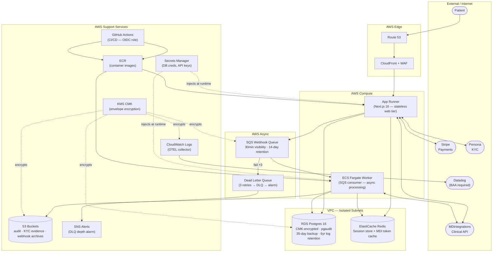
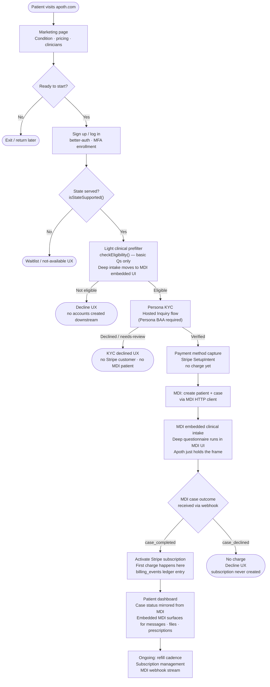
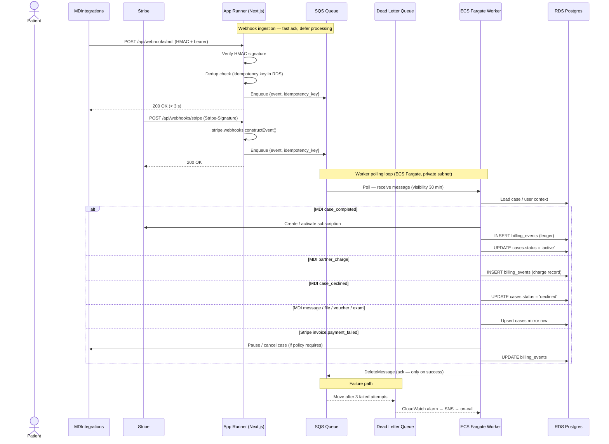

# Apoth — System Architecture

> Living document. Update when architectural decisions change. Not frozen at PR time (unlike `docs/features/`).

---

## 1. What the system is

Apoth is a patient-facing telehealth platform built in two layers:

1. **Marketing + conversion surface** — a Next.js site that converts curiosity into a booked visit. Static-first today; gradually adding auth, intake, and payments.
2. **Clinical workflow shell** — minimal intake gating (state availability, light eligibility prefilter), then hands off to MD Integrations for clinical work. Apoth orchestrates commerce and identity; it does not practice medicine.

**Thin-PHI posture.** Apoth's database holds the minimum needed: opaque foreign keys (`mdi_patient_id`, `stripe_customer_id`, `mdi_case_id`, `persona_inquiry_id`), consent records, and a billing-events ledger. Full clinical PHI lives in MDIntegrations. This limits HIPAA scope, simplifies BAA coverage, and shrinks the attack surface.

---

## 2. System topology



**VPC isolation notes:**
- App Runner attaches to the VPC via a `CfnVpcConnector` placed in private subnets — it is a managed service, not a VPC resource itself.
- ECS Fargate tasks run in private subnets with a scoped security group (egress: RDS port 5432, Redis port 6379, HTTPS to VPC interface endpoints only).
- RDS and Redis sit in isolated subnets with `allowAllOutbound: false`. No egress at all.
- Seven VPC interface endpoints (Secrets Manager, KMS, SQS, ECR, ECR Docker, CloudWatch Logs, CloudWatch Metrics) keep PHI-adjacent traffic off the public internet. An account-restrictive endpoint policy prevents cross-account access.

---

## 3. Patient onboarding flow



**Key invariant (RULES.md):** No card is ever charged before MDI emits `case_completed`. The SetupIntent captures the payment method but creates zero charges. The subscription is only activated in the `case_completed` webhook handler — not at any earlier point. This must remain test-enforced (see `src/lib/billing/subscription.ts`).

---

## 4. Async webhook / event processing



**Why SQS + Fargate instead of inline processing:**
- MDI and Stripe both have strict acknowledgement timeouts (≤ 3 s / ≤ 30 s respectively). Processing inline risks timeout-driven duplicate delivery.
- The worker can safely retry failed handlers without re-acknowledging the webhook source.
- The DLQ provides a recovery surface (`aws sqs start-message-move-task`) with full message history.

---

## 5. PHI data ownership

| Data | Owned by | Apoth stores |
|---|---|---|
| Full clinical history, prescriptions, labs | MDIntegrations | `mdi_case_id`, `mdi_patient_id` (opaque pointers) |
| Payment instrument details | Stripe | `stripe_customer_id`, `stripe_subscription_id` (opaque pointers). No card data in Apoth. No PHI in Stripe metadata. |
| KYC / identity documents | Persona | `persona_inquiry_id` + pass/fail status only |
| Patient PII (name, DOB, address) | Apoth RDS — KMS-encrypted | CMK-encrypted columns (T-043); access via IAM auth only |
| Consent records + sha256 evidence | Apoth S3 + RDS | Versioned consent documents; grant rows with sha256 |
| Billing ledger | Apoth RDS | `billing_events` table: amounts, timestamps, MDI charge IDs |
| Audit log | Apoth RDS + CloudWatch | Tamper-evident hash chain (T-044); 6yr retention |

**Stripe is not BAA-eligible.** Only opaque, non-PHI identifiers are ever placed in Stripe metadata. Enforced by lint rule (L-002 from handover).

---

## 6. Key architectural decisions

| Area | Decision | Rationale |
|---|---|---|
| **Auth** | better-auth (self-hosted on AWS) | BAA-compatible; Clerk was the original plan but does not offer a BAA |
| **Payment timing** | Stripe SetupIntent → subscription activates on `case_completed` | Structurally enforces "no charge before clinical" — not via trials or policy |
| **KYC placement** | Before payment in the onboarding journey | Declined KYC never creates a Stripe customer or MDI patient — cleaner rollback |
| **Clinical integration** | MDIntegrations, mirrored not authoritative | Apoth mirrors case state from webhooks; MDI is the source of truth. Local state is a read cache. |
| **Pharmacy (v1)** | MDI passthrough | Direct 503A pharmacy integration explicitly deferred. Partner BAA tracks separately (T-066). |
| **Hosting** | AWS App Runner + CDK (not Vercel) | VPC isolation required for PHI-adjacent data; App Runner gives a managed container runtime inside the VPC boundary |
| **PHI posture** | Minimal in Apoth DB | Smaller BAA scope, smaller breach surface, simpler data retention/deletion |
| **Observability** | Datadog (BAA required) | Datadog has a BAA program; must be executed before any PHI-touching log data flows to it (T-042) |

---

## 7. Implementation status

**11 / 74 tickets complete (15%)**

### ✅ Complete

| Phase | Tickets | What landed |
|---|---|---|
| Foundation | T-002, T-003, T-004 | Next.js 16 scaffold, Tailwind + design tokens, full single-page marketing surface (Hero, HowItWorks, Conditions, Pricing, Clinicians, FAQ, Footer, Nav) |
| LegitScript Compliance | T-005–T-009 | `/about`, `/privacy`, `/terms`, `/get-started` routes; HIPAA Privacy Policy + NPP; Terms of Service + telehealth disclosure; FDA-status badges on all condition cards; Apoth rebrand |
| Design System | T-010 | OKLCH palette resolved (clay / sage / bone), Fraunces + Inter font pairing, Tailwind token config |
| Infrastructure | T-017, T-039 | Vitest + RTL test framework + TDD invariant stubs (state-availability, eligibility, payment-gate); CDK skeleton — VPC, RDS Postgres 16, App Runner, ECS Fargate, SQS, S3 buckets, IAM roles, observability stubs |

### 🔶 In progress

| Phase | Ticket | Status |
|---|---|---|
| Infrastructure | T-038 | AWS account creation + AWS BAA execution + IAM baseline. Blocks all CDK deploys. |
| Design System | T-011, T-012 | Component documentation and WCAG 2.2 AA audit not started. |

### ⬜ Not started — Infrastructure (immediate next, unblocks everything)

| Ticket | What it delivers |
|---|---|
| T-040 | Drizzle ORM schema + baseline migrations: `users`, `consent_documents`, `consent_grants`, `audit_log`, `mdi_cases`, `billing_events` |
| T-041 | Secrets Manager wiring + environment isolation sentinels (staging secrets can't leak to prod) |
| T-042 | Full observability: CloudWatch dashboards, OTEL collector sidecar, Datadog integration **(BAA gate)** |
| T-043 | KMS envelope encryption module — Drizzle column-level helpers for PHI-adjacent fields |
| T-044 | Audit log: table + SHA-256 hash chain + CloudWatch immutable sink (HIPAA 6yr requirement) |
| T-045 | Webhook ingestion: Next.js route handlers → SQS enqueue with idempotency |
| T-046 | Background worker: actual SQS consumer code running in the ECS Fargate service |
| T-047 | Consent versioning: S3 document store + `consent_grants` table + re-prompt logic |

### ⬜ Not started — remaining phases

| Phase | Tickets | Key dependency |
|---|---|---|
| Auth | T-013–T-016 | better-auth setup, sign-in/sign-up + MFA, session middleware + journey gates, KMS-encrypted patient PII columns |
| Payments | T-023–T-027 | Stripe SDK + BAA-aware metadata policy, SetupIntent capture, per-condition subscriptions, Stripe webhook receiver, refunds/dunning |
| Identity Verification | T-048–T-051 | **Persona BAA gate.** Hosted Inquiry flow, webhook receiver, `kyc_verifications` schema, declined UX |
| MDIntegrations | T-052–T-065 (14 tickets) | Phase 0 spike (event catalog + fixture library) → token client → HTTP client → patient/case creation → 40+ webhook handlers → dashboard → reconciler |
| Intake Flow | T-018–T-022 | Needs auth + MDI scaffolding to be meaningful: onboarding orchestration, state-availability logic, eligibility prefilter, intake UI |
| Pharmacy Fulfillment | T-066–T-068 | **Pharmacy partner BAA gate.** MDI passthrough validation; direct integration deferred |
| Launch Blockers | T-028–T-033 | Attorney review of `/privacy` + `/terms`, replace all placeholder data (contact, address, NPI, pharmacy, pricing) |
| Hardening | T-069–T-075 | Stripe↔MDI reconciler, audit-chain integrity verifier, dashboards, admin audit view, LegitScript submission package, pen test, retention policy |
| Deploy | T-034–T-037 | SEO assets, BAA-aware analytics, Route 53 + CloudFront + ACM, production App Runner deploy |

---

## 8. Critical path to a working product

```
T-038 (AWS account + BAA)
  └─► T-040–T-047 (Infrastructure: DB, secrets, KMS, audit, webhooks, worker, consent)
        └─► T-013–T-016 (Auth: better-auth, MFA, session middleware, PII columns)
              ├─► T-023–T-027 (Payments: Stripe primitives in test mode)
              │     └─► T-048–T-051 (KYC: Persona — BAA gate)
              │           └─► T-052 (MDI Phase 0 spike ← highest-leverage early ticket)
              │                 └─► T-053–T-065 (MDI: token client → webhooks → dashboard)
              │                       └─► T-018–T-022 (Intake flow)
              │                             └─► T-066–T-068 (Pharmacy — BAA gate)
              └─► T-028–T-033 (Launch blockers — can run in parallel with MDI)
                    └─► T-069–T-075 (Hardening + LegitScript prep)
                          └─► T-034–T-037 (Deploy)
```

**T-052 (MDI Phase 0 spike)** is explicitly the highest-leverage early ticket. Its deliverable is an event catalog + fixture library that maps all 40+ MDI webhook types before any handler code is written. Everything in the MDI phase depends on this catalog.

---

## 9. BAA / external dependency gates

These require wall-clock time (vendor legal review). Start these in parallel with coding work.

| BAA / dependency | Blocks | Ticket |
|---|---|---|
| **AWS BAA** | All CDK deploys, all PHI-touching infrastructure | T-038 |
| **Datadog BAA** | Full observability; any PHI-adjacent log data flowing to Datadog | T-042 |
| **Persona BAA** | KYC phase (T-048–T-051) | T-048 |
| **MDIntegrations BAA** | MDI phase (T-052–T-065) | Referenced T-052 onwards |
| **Pharmacy partner BAA** | Pharmacy phase (T-066–T-068) + `T-032` (pharmacy disclosure copy) | T-066 |
| **Healthcare attorney review** | `/privacy` and `/terms` can remove `LegalReviewBanner` | T-028 |

**Stripe is not BAA-eligible.** Only opaque, non-PHI identifiers are placed in Stripe metadata. This is a hard architectural constraint, not a policy preference.
